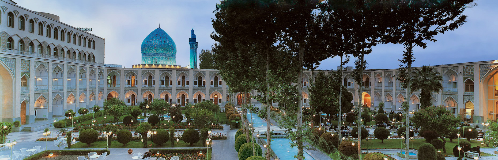

# 🏨 Hotel Abbasi - Modern UI Redesign

 <!-- Note: Ensure you have a nice preview image here -->

A modern, responsive, and visually engaging landing page for **Hotel Abbasi** (the oldest hotel in the world), built with a strong focus on high-quality UI/UX patterns, fluid CSS animations, and robust frontend architecture. 

**[🔗 View Live Demo](https://elyasforghani.github.io/hotelabbasi-tailwindproject/)**

---

## 📖 About The Project

This project is a frontend recreation of the Hotel Abbasi website, designed to showcase advanced layout techniques, seamless responsive design, and proper RTL (Right-to-Left) typography for the Persian language. The goal was to blend the historical and elegant aesthetics of the Safavid architecture with modern web standards.

### ✨ Key Features

*   **Custom RTL Layout:** Fully optimized for Persian (Farsi) reading flow using modern CSS techniques.
*   **Dynamic Hero Slider:** Smooth, responsive image transitions highlighting the beauty of the hotel's courtyards and traditional rooms.
*   **Mega-Menu Navigation:** A highly structured, hover-based navigation system allowing easy access to rooms, restaurants, facilities, and galleries.
*   **Responsive UI/UX:** Perfectly adapts to mobile, tablet, and desktop screens without losing the elegant visual structure.
*   **Clean DOM & Event Handling:** Optimized JavaScript logic for smooth interactions and component state management.

---

## 🛠️ Built With

*   **Semantic HTML5**
*   **Tailwind CSS** - For rapid, utility-first styling and complex responsive layouts.
*   **Vanilla JavaScript (ES6+)** - Handling DOM manipulation, sliders, and interactive UI states.
*   *(Optional: Mention Swiper.js or GSAP here if you used them for the slider/animations)*

---

## 🧠 What I Learned

Building this project provided a great opportunity to refine my frontend engineering skills. Some of the core takeaways include:
*   Mastering **Tailwind CSS** utility classes for complex, nested grid and flexbox layouts.
*   Handling complex **DOM manipulations** and event listeners to ensure the user interface feels fast and responsive.
*   Implementing **UI/UX best practices** to make a culturally rich design feel modern and accessible.
*   Managing state and layout flow specifically for Right-to-Left (RTL) languages.

---

## 🚀 Getting Started

To get a local copy up and running, follow these simple steps:

### Prerequisites
Make sure you have Node.js installed if you plan on modifying the Tailwind configuration.

### Installation

1. Clone the repository:
```sh
   git clone [https://github.com/elyasforghani/hotelabbasi-tailwindproject.git](https://github.com/elyasforghani/hotelabbasi-tailwindproject.git)
